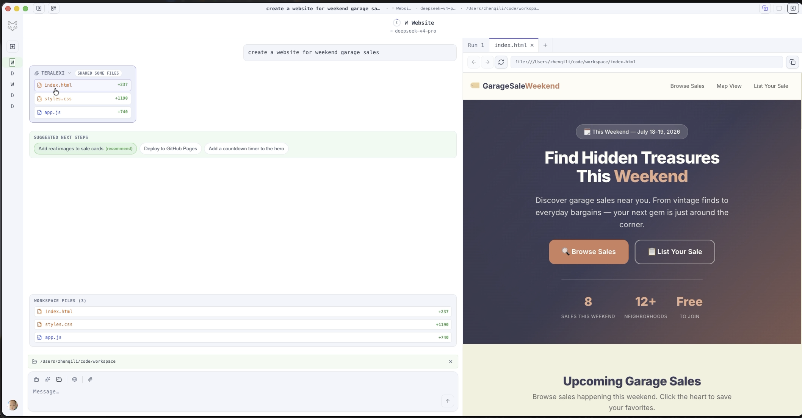
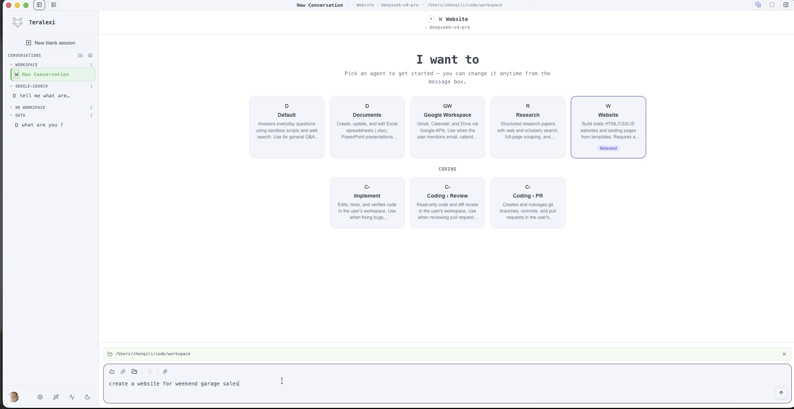
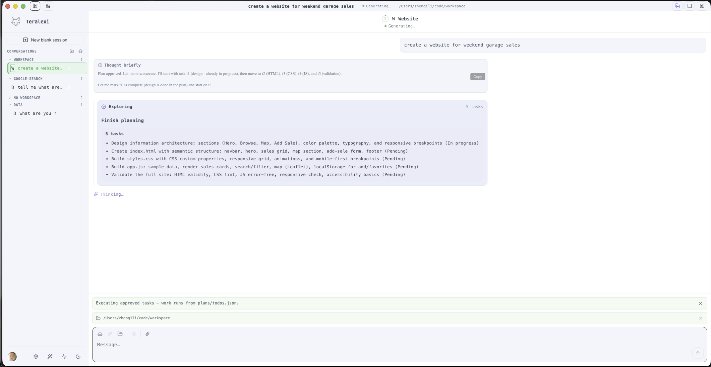
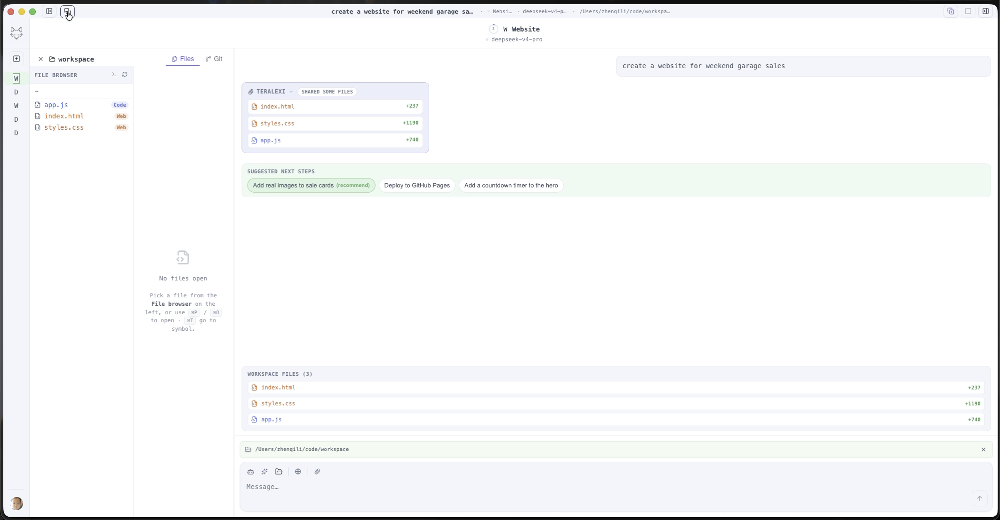

# Teralexi

<!-- ci-status-start -->
[](https://github.com/Naughty-Otters/Teralexi/actions/workflows/ci.yml)

| | |
| --- | --- |
| **Last successful build** | 2026-07-19T18:23:08Z |
| **Branch** | `main` |
| **Commit** | [`a076bc6`](https://github.com/Naughty-Otters/Teralexi/commit/a076bc64e3e4b2b12d09c3803bf3b299bdf72739) |
| **Workflow run** | [View logs](https://github.com/Naughty-Otters/Teralexi/actions/runs/29698244519) |
<!-- ci-status-end -->

Local AI agent desktop — research, code, chat from your phone, extend with skills & MCP, pick any LLM, and build memory over time, all on your machine.

[中文说明](./README_ZH.md) · [Product site](https://www.teralexi.com/)

## Download

Prefer a ready-made installer? Get macOS and Windows builds from **[teralexi.com](https://www.teralexi.com/)** — no build required.

This repository is for running and contributing from source.

## Demo

Website agent walkthrough — pick an agent, plan, generate files, and preview the result. More product visuals: [teralexi.com](https://www.teralexi.com/).

[](./media/howto_website_2.mp4)

https://github.com/Naughty-Otters/Teralexi/raw/open_source_b/media/howto_website_2.mp4








## Highlights

- Research with an agent that browses, gathers sources, and keeps you in the loop
- Workspace & built-in IDE with inline git diff review before changes land
- Channel chat (WhatsApp, Slack, Google, Discord, and more)
- Skills & MCP hub, plus custom skills under `~/.teralexi/skills/`
- Local and cloud LLM providers (Ollama, OpenAI, Anthropic, Gemini, and more)
- Local-first memory and scheduled agent jobs

## Build from source

**Requirements:** Node.js 22+ and `npm`.

```bash
npm install
npm run dev
```

`npm run dev` uses Electron hot reload and connects to the **production** platform API (`https://api.teralexi.com/`) by default.

### Use your own backend

Point at a local or staging API only when you need to:

```bash
cp env/.dev.local.env.example env/.env
# edit BASE_API in env/.env, then:
npm run dev
```

Or one-off:

```bash
BASE_API=http://localhost:8000 npm run dev
```

Local load order for `npm run dev`: `env/.dev.env` → `env/.env` (wins) → `env/.dev.local.env` (wins if present).

## Useful commands

```bash
npm run dev          # desktop app (production API by default)
npm run build        # production desktop build
npm run build:web    # renderer/main/preload build (CI validation)
npm run test:unit    # unit tests
```

## Documentation

| Doc | Purpose |
| --- | --- |
| [BUILD-AND-RELEASE.md](./BUILD-AND-RELEASE.md) | Env modes, local builds, CI & release |
| [CODING.md](./CODING.md) | Contributor UI / IPC notes |
| [skills/SKILL-DEVELOPMENT.md](./skills/SKILL-DEVELOPMENT.md) | Authoring agent skills |
| [docs/](./docs/) | Releases, code signing, support upload |
| [CHANGELOG.md](./CHANGELOG.md) | Version history |
| [teralexi.com](https://www.teralexi.com/) | Download & product overview |

## License

Teralexi is licensed under the [Apache License 2.0](./LICENSE).
