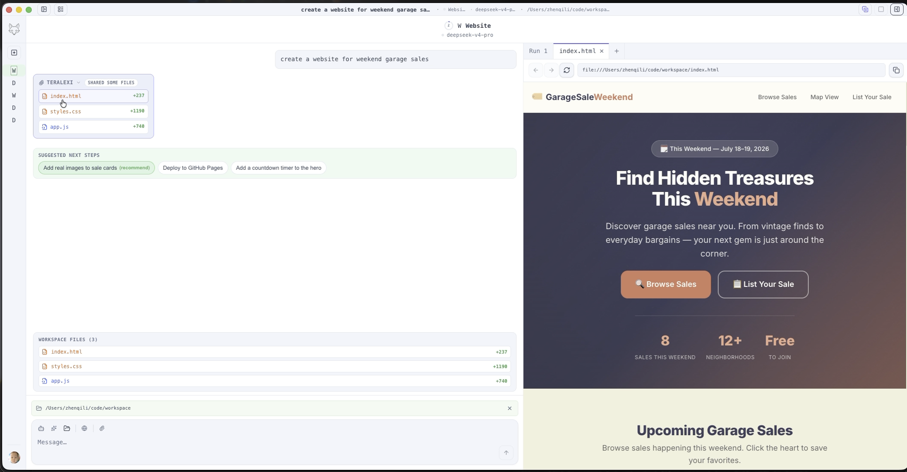
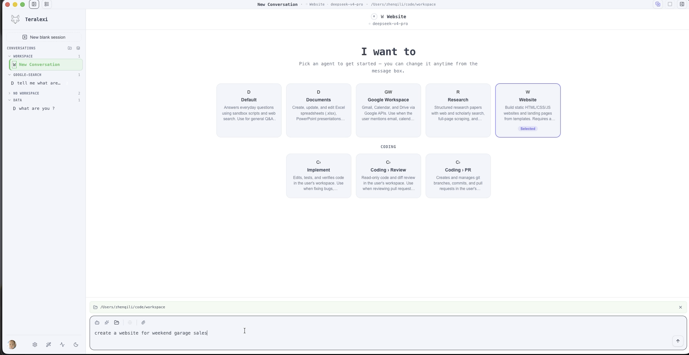
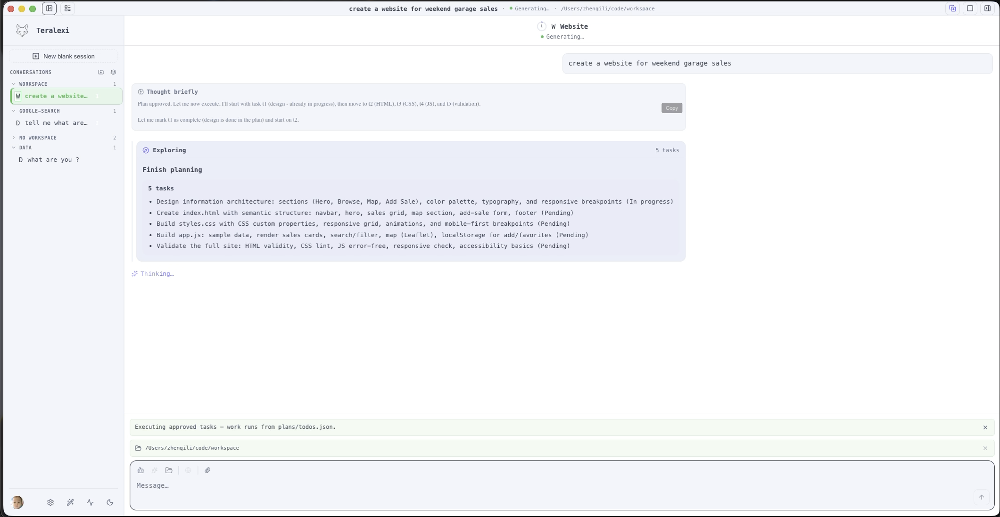
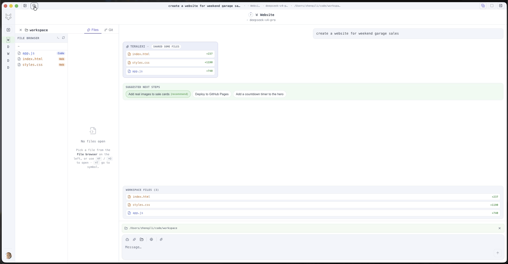

# Teralexi

<!-- ci-status-start -->
[](https://github.com/Naughty-Otters/Teralexi/actions/workflows/ci.yml)
[](https://github.com/Naughty-Otters/Teralexi/actions/workflows/ci.yml)
[](https://github.com/Naughty-Otters/Teralexi/releases/latest)

| | |
| --- | --- |
| **Last successful build** | 2026-07-28T17:28:45Z |
| **Branch** | `main` |
| **Commit** | [`57462be`](https://github.com/Naughty-Otters/Teralexi/commit/57462be6e56ce55db155e9866f99414d42335ba6) |
| **Workflow run** | [View logs](https://github.com/Naughty-Otters/Teralexi/actions/runs/30382146387) |
<!-- ci-status-end -->

Local AI agent desktop — research, code, chat from your phone, extend with skills & MCP, pick any LLM, and build memory over time, all on your machine.

[中文说明](./README_ZH.md) · [Product site](https://www.teralexi.com/)

## Download

### One-liner (recommended)

Installs the **CLI** and, on macOS/Windows, the **desktop app** from the [stable release channel](https://api.teralexi.com/desktop/releases/stable):

```bash
curl -fsSL https://raw.githubusercontent.com/Naughty-Otters/Teralexi/main/install/install.sh | bash
# Prefer: curl -fsSL https://www.teralexi.com/install | bash   # when the site mirrors install.sh
```

Useful flags:

```bash
curl -fsSL …/install.sh | bash -s -- --cli-only       # CLI only
curl -fsSL …/install.sh | bash -s -- --desktop-only   # desktop app only
curl -fsSL …/install.sh | bash -s -- --version 0.0.5
```

### Desktop app only

Ready-made installers (DMG / NSIS) also on **[teralexi.com](https://www.teralexi.com/)**, or the same artifacts under [api.teralexi.com/desktop/releases/stable](https://api.teralexi.com/desktop/releases/stable).

### CLI via package managers

`teralexi-ai` installs the **`teralexi` bin only** (no desktop binary inside the npm package):

```bash
npm i -g teralexi-ai@latest        # also works with bun / pnpm / yarn
```

After the Homebrew tap is published:

```bash
brew tap Naughty-Otters/tap
brew install teralexi                 # CLI formula
brew install --cask teralexi-desktop  # desktop .app (sha256 filled by release pipeline)
```

Also planned: `scoop install teralexi` / `choco install teralexi` (see [docs/CLI-DISTRIBUTION.md](./docs/CLI-DISTRIBUTION.md)).

### After install

```bash
teralexi --version
teralexi doctor          # Node, ~/.teralexi, desktop path
teralexi open            # launch desktop if installed
# Optional: export TERALEXI_APP=/path/to/Teralexi.app
```

This repository is for running and contributing from source.

## Demo

Website agent walkthrough — pick an agent, plan, generate files, and preview the result. More product visuals: [teralexi.com](https://www.teralexi.com/).

[](./media/howto_website_2.mp4)

https://github.com/Naughty-Otters/Teralexi/raw/main/media/howto_website_2.mp4








## Highlights

- Research with an agent that browses, gathers sources, and keeps you in the loop
- Workspace & built-in IDE with inline git diff review before changes land
- Channel chat (WhatsApp, Slack, Google, Discord, and more)
- Skills & MCP hub, plus custom skills under `~/.teralexi/skills/`
- Local and cloud LLM providers (Ollama, OpenAI, Anthropic, Gemini, and more)
- Local-first memory and scheduled agent jobs

## Build from source

**Requirements:** Node.js 22+ and `npm`.

```bash
npm install
npm run dev
```

`npm run dev` uses Electron hot reload. By default it loads `env/.dev.env`, which sets `BASE_API` to the **public Teralexi platform** (`https://api.teralexi.com/`). That enables optional cloud features (sign-in, entitlements, usage metrics when signed in, support upload, website publish, auto-update checks).

You can use **local LLMs without an account** (Settings → LLM → Ollama / llama.cpp).

### Use your own backend or local-only mode

```bash
cp env/.dev.local.env.example env/.env
# edit BASE_API in env/.env (e.g. http://localhost:8000), then:
npm run dev
```

Or one-off:

```bash
BASE_API=http://localhost:8000 npm run dev
```

To explore the UI without a platform API, set `BASE_API=` in your override env file. Cloud sign-in, metrics, support upload, website publish, and in-app updates will be unavailable.

Local load order for `npm run dev`: `env/.dev.env` → `env/.env` (wins) → `env/.dev.local.env` (wins if present).

The platform API server is **not** included in this repository. Client contracts: [docs/SUBSCRIPTION-INTEGRATION.md](./docs/SUBSCRIPTION-INTEGRATION.md).

## Privacy & telemetry

- Most agent data stays under `~/.teralexi/` on your machine (local-first).
- When signed in to a platform API, the app may send **provider usage metrics** (model/token counters) if your plan includes `metrics.write`.
- **Support upload** and **website publish** only run when you trigger them and your entitlement allows it.
- Packaged builds check `{BASE_API}/desktop/releases/stable/` for updates (no account required). Forks should change `BASE_API` / `build.json` publish URL so they do not auto-update from Teralexi’s feed.

See [Privacy Policy](https://www.teralexi.com/privacy.html).

## Useful commands

```bash
npm run dev          # desktop app (public platform API by default)
npm run build        # production desktop build
npm run build:web    # renderer/main/preload build (CI validation)
npm run test:unit    # unit tests
```

## Documentation

| Doc | Purpose |
| --- | --- |
| [CONTRIBUTING.md](./CONTRIBUTING.md) | How to contribute |
| [SECURITY.md](./SECURITY.md) | Vulnerability reporting |
| [BUILD-AND-RELEASE.md](./BUILD-AND-RELEASE.md) | Env modes, local builds, CI & release |
| [CODING.md](./CODING.md) | Contributor UI / IPC notes |
| [skills/SKILL-DEVELOPMENT.md](./skills/SKILL-DEVELOPMENT.md) | Authoring agent skills |
| [docs/SKILLS-ECOSYSTEM.md](./docs/SKILLS-ECOSYSTEM.md) | SKILL.md / Codex / Claude / Claw compat + CLI install |
| [docs/CLI-DISTRIBUTION.md](./docs/CLI-DISTRIBUTION.md) | curl\|bash, npm, Homebrew, Scoop, Chocolatey |
| [docs/](./docs/) | Releases, code signing, support upload, App Store notes |
| [CHANGELOG.md](./CHANGELOG.md) | Version history |
| [NOTICE](./NOTICE) | Third-party / trademark notes |
| [teralexi.com](https://www.teralexi.com/) | Download & product overview |

## License

Teralexi is licensed under the [Apache License 2.0](./LICENSE). See [NOTICE](./NOTICE) for trademark and third-party notes.
