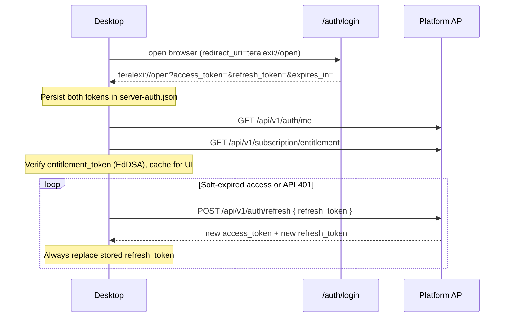

# Client subscription & auth integration

How the Teralexi desktop client authenticates against the platform API, renews
sessions, and fetches signed subscription entitlement. Canonical server contract:
`OpenFDEServer/docs/subscription-integration/README.md`.

**Current phase:** every authenticated user is on the `base` plan with
`metrics.write` and `support.upload`.

---

## Three tokens

| Token | Stored in | Lifetime | Purpose |
|-------|-----------|----------|---------|
| **`access_token`** | `~/.teralexi/accounts/server-auth.json` | ~24h | `Authorization: Bearer …` for API / entitlement |
| **`refresh_token`** | same file | ~1y (rotated on each use) | `POST /api/v1/auth/refresh` — renew without Google |
| **`entitlement_token`** | entitlement cache | ~15m | Signed subscription snapshot (EdDSA JWT) |

Google identity (`google-account.json`) is separate: it drives UI “signed in”
and can supply a Google `id_token` for the initial exchange only.

---

## Auth flow



### Endpoints used by the client

| Method | Path | When |
|--------|------|------|
| `POST` | `/api/v1/auth/google` | Exchange Google `id_token` → platform tokens |
| `POST` | `/api/v1/auth/refresh` | Rotate session with opaque `refresh_token` |
| `POST` | `/api/v1/auth/logout` | Sign-out: revoke refresh family (best-effort) |
| `DELETE` | `/api/v1/auth/account` | Permanently delete platform account (App Store 5.1.1(v)) |
| `POST` | `/api/v1/auth/token` | Optional Google re-bind (not silent renew) |
| `GET` | `/api/v1/auth/me` | Session probe / user id for entitlement binding |
| `GET` | `/api/v1/subscription/entitlement` | Signed entitlement snapshot |

Do **not** use `POST /api/v1/auth/token` with only a Bearer access JWT as the
session renew path — that is Google re-bind. Silent renew is always
`/auth/refresh`.

### Web handoff

`/auth/login` redirects to:

```
teralexi://open?access_token=…&refresh_token=…&expires_in=…
```

The client stores **both** platform tokens. Do not depend on Google ID token
lifetime for the desktop session.

---

## Entitlement refresh

| Event | Action |
|-------|--------|
| App launch / sign-in | Fetch entitlement immediately |
| Every **10 minutes** | Background poll |
| Main window focus | Refresh + session check |
| New conversation | Background refresh |
| Manual (settings) | Refresh |
| API `401` | `/auth/refresh` once, then retry; if refresh fails → re-login |

Verification uses the embedded Ed25519 public key (`ENTITLEMENT_SIGNING_PUBLIC_KEY_PEM`),
`iss` = API base URL, `aud` = `teralexi-desktop`. See
`src/main/services/entitlement-verifier.ts` and
`src/shared/subscription/entitlement-issuer.ts`.

Feature gates use the verified `features` array (see
`src/shared/subscription/entitlement-features.ts`), not a local `isPro` flag.

---

## Sign-out

Local sign-out and `teralexi://logout` clear Google identity, server tokens, and
entitlement cache, and call `POST /api/v1/auth/logout` with the last refresh
token when available.

**Account deletion** (Settings → Accounts → Delete account) follows
`OpenFDEServer/docs/subscription-integration/account-deletion.md`:

1. UI confirmation in Settings.
2. `DELETE /api/v1/auth/account` with `Authorization: Bearer <access_token>` and
   body `{ "confirm": true }`.
3. On `200` → clear local identity/tokens (skip remote logout; account is gone).
4. On `401` → `POST /api/v1/auth/refresh` once and retry; if refresh fails → sign out.
5. On `400` / `503` → keep the session so the user can fix/retry.

See [MAC-APP-STORE-READY.md](./MAC-APP-STORE-READY.md).


---

## Configuration

| Env / prop | Role |
|------------|------|
| `BASE_API` → `app.base.apiUrl` | API host (also entitlement JWT `iss`) |
| `ENTITLEMENT_SIGNING_PUBLIC_KEY_PEM` | Public key to verify `entitlement_token` |
| `app.teralexi.googleAuthLoginUrl` | Override path/URL for `/auth/login` |

Environments: local `http://localhost:8000`, staging / production hosts from
server docs — `expectedIssuer` must match the API base for that build.
