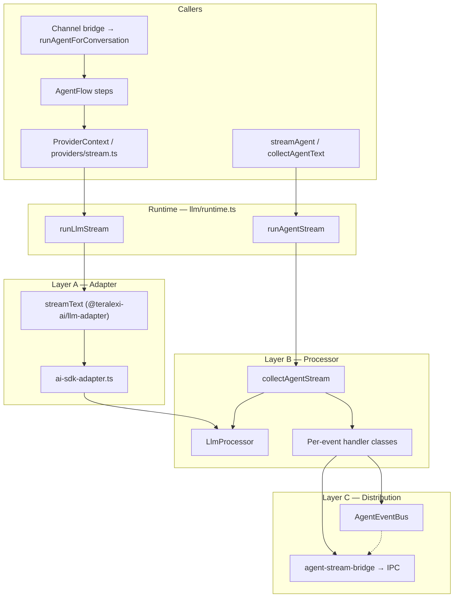
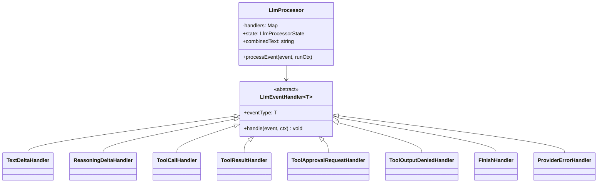
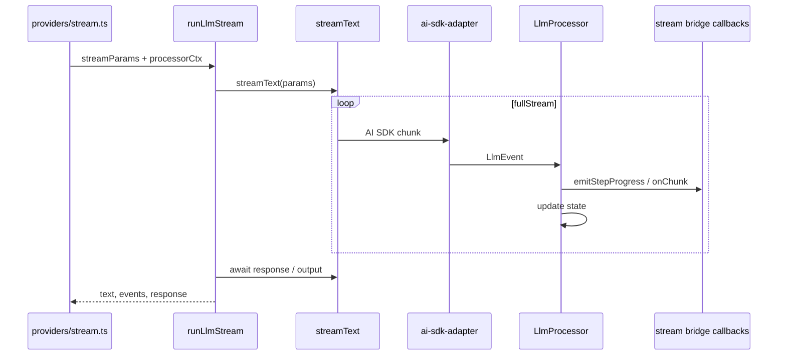
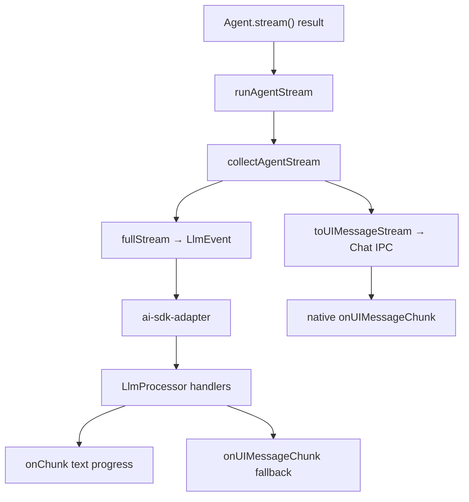
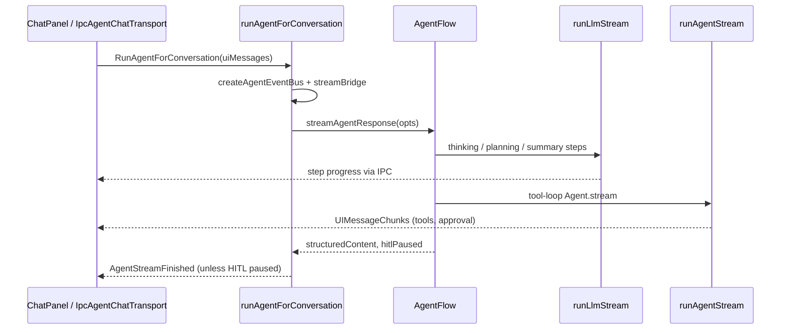

# LLM Event Pipeline

Event-driven LLM processing for the teralexi **main process** agent pipeline. Inspired by [OpenCode](https://github.com/anomalyco/opencode)'s `SessionProcessor` + `LLMEvent` pattern, adapted for Electron (IPC instead of HTTP/SSE).

The AI SDK (`streamText`, `Agent.stream`) remains the **provider boundary**. Application code does not call `streamText` directly — it goes through this pipeline.

---

## Goals

| Goal | How |
|------|-----|
| Hide AI SDK stream details | Normalize `fullStream` → `LlmEvent` in one adapter |
| Single orchestration point | `LlmProcessor` dispatches events to typed handler classes |
| Optional pub/sub | `AgentEventBus` publishes domain events per run |
| Preserve existing behavior | Same IPC payloads, Chat transport, HITL, channel replies |
| Renderer unchanged | `@ai-sdk/vue` + `IpcAgentChatTransport` stay as-is |

---

## Architecture overview



---

## Three layers

### Layer A — Provider adapter (`ai-sdk-adapter.ts`)

Maps AI SDK `fullStream` chunks to provider-neutral **`LlmEvent`** values (defined in `events.ts`).

```
text-start / text-delta / text-end
reasoning-start / reasoning-delta / reasoning-end
tool-input-start / tool-call / tool-result / tool-error
tool-approval-request / tool-output-denied
step-start / step-finish / finish
provider-error
```

Only [`runtime.ts`](runtime.ts) imports `streamText`, via the internal alias [`@teralexi-ai/llm-adapter`](../../../teralexi-ai/llm-adapter.ts).

### Layer B — Processor + handlers

[`LlmProcessor`](processor.ts) owns mutable run state and dispatches each `LlmEvent` to a registered handler class:



| Handler class | Event type | Effect |
|---------------|------------|--------|
| `TextDeltaHandler` | `text-delta` | Accumulate text; emit progress via `onChunk` |
| `ReasoningDeltaHandler` | `reasoning-delta` | Accumulate reasoning; emit progress via `onChunk` |
| `ToolInputStartHandler` | `tool-input-start` | Track tool part `pending` |
| `ToolCallHandler` | `tool-call` | Track tool part `running`; emit `tool-input-available` UI chunk |
| `ToolResultHandler` | `tool-result` | Append tool output to transcript; emit `tool-output-available` UI chunk |
| `ToolErrorHandler` | `tool-error` | Append error block to transcript; emit `tool-output-error` UI chunk |
| `ToolApprovalRequestHandler` | `tool-approval-request` | Track pending approval; forward UI chunk to IPC |
| `ToolOutputDeniedHandler` | `tool-output-denied` | Clear pending approval; forward UI chunk to IPC |
| `StepFinishHandler` | `step-finish` | Capture step usage |
| `FinishHandler` | `finish` | Capture usage; publish `agent.llm.finish` |
| `ProviderErrorHandler` | `provider-error` | Throw (retry layer handles) |

Handlers live under [`handlers/`](handlers/). Register new ones in [`handlers/registry.ts`](handlers/registry.ts).

Each handler receives:

- **`event`** — typed to its `LlmEvent` variant
- **`ctx.state`** — shared mutable state (`text`, `toolParts`, `usage`, …)
- **`ctx.run`** — per-run sinks: `onChunk`, `emitStepProgress`, `bus`, `mode` (`progress` | `silent`)

### Layer C — Event bus + IPC

[`AgentEventBus`](../bus/agent-event-bus.ts) is an in-process pub/sub scoped to one agent run. Domain events are defined in [`domain-events.ts`](../bus/domain-events.ts):

- `agent.llm.text.delta`
- `agent.llm.tool.updated`
- `agent.llm.step.progress`
- `agent.llm.finish`

At conversation entry ([`conversation.ts`](../../engine/conversation.ts)), each run creates a bus and attaches [`attachIpcProjector`](../bus/ipc-projector.ts). Most user-visible output still uses **direct callbacks** on `AgentResponseOpts` for parity with the pre-migration behavior.

[`createAgentStreamBridge`](../agent-stream-bridge.ts) forwards to Electron IPC unchanged:

- `AgentStreamChunk` (legacy string deltas)
- `AgentUIMessageChunk` (AI SDK UI chunks, step progress, HITL)
- `AgentStreamFinished`

---

## Two runtime entry points

### 1. `runLlmStream` — pipeline LLM calls

Used by thinking, planning, summary, memory abstractor, skill compile, form inference, etc.



Call chain:

```
AgentFlow step
  → ProviderContext.streamTextToStepProgress()
  → providers/stream.ts (withLlmRetry)
  → runLlmStream({ mode: 'progress', processorCtx: { emitStepProgress, bus } })
```

### 2. `runAgentStream` — tool-loop (`Agent.stream`)

Thin wrapper around `LlmProcessor.collectAgentStream` — dual drain in one place:



[`ui-message-projector.ts`](ui-message-projector.ts) holds `forwardAgentUiMessageStream` (native UI forward) plus transcript helpers (`serializeForAgentCollect`, `collectToolOutputFallbackText`, `reconcilePendingApprovalKeys`).

---

## End-to-end: desktop Chat request



---

## HITL (human-in-the-loop)

| HITL type | Mechanism |
|-----------|-----------|
| **Tool approval** | `fullStream` → pending state; `toUIMessageStream` → native UI chunks → IPC |
| **Form collection** | `CollectFormDataStep` emits `data-collect-form-request` via `onUIMessageChunk` |
| **Resume** | Renderer sends `clientUiMessages` with approval/form response → `AgentFlow` resumes pending execution |

After approval, the **second** `Agent.stream()` call includes approval in model messages; the AI SDK runs `tool.execute()`.

---

## Channel integrations (Telegram, Slack, …)

Channels call `runAgentForConversation` **without** `uiMessages`. User text is loaded from the conversation store. The same LLM pipeline runs internally; only the final `finalContent` is sent back to the channel.

See [`conversation-bridge.integration.test.ts`](../../channels/framework/conversation-bridge.integration.test.ts).

---

## Directory layout

```
src/main/agent/
├── llm/
│   ├── README.md                 ← this file
│   ├── events.ts               LlmEvent union types
│   ├── ai-sdk-adapter.ts       fullStream → LlmEvent
│   ├── llm-response.ts         collected events + .text helpers
│   ├── processor.ts            LlmProcessor dispatcher
│   ├── processor.ts            LlmProcessor, collectAgentStream
│   ├── runtime.ts              runLlmStream, runAgentStream
│   ├── ui-message-projector.ts   transcript collect helpers
│   ├── approval-keys.ts          HITL pending-approval key tracking
│   ├── handlers/
│   │   ├── types.ts            LlmEventHandler base class
│   │   ├── publishers.ts       shared publishTextDelta, etc.
│   │   ├── *-handler.ts        one class per event type
│   │   └── registry.ts         default handler set
│   └── *.test.ts
├── bus/
│   ├── agent-event-bus.ts
│   ├── domain-events.ts
│   └── ipc-projector.ts
├── providers/stream.ts           delegates to runLlmStream
├── agent-stream-bridge.ts        IPC callbacks (unchanged contract)
└── engine/conversation.ts        per-run bus + opts wiring

src/teralexi-ai/
└── llm-adapter.ts                only streamText import site
```

---

## Extending the pipeline

### Add a new actionable `LlmEvent` type

1. Add the variant to [`events.ts`](events.ts).
2. Map it in [`ai-sdk-adapter.ts`](ai-sdk-adapter.ts) (`aiSdkEventToLlmEvents`).
3. Create `handlers/my-event-handler.ts` extending `LlmEventHandler<'my-type'>`.
4. Register it in [`handlers/registry.ts`](handlers/registry.ts).
5. Add tests in `handlers/handlers.test.ts` and `ai-sdk-adapter.test.ts`.

No changes to `LlmProcessor.processEvent` are required — it dispatches by registry lookup.

### Custom handler set (tests or experiments)

```typescript
import { LlmProcessor } from '@main/agent/llm/processor'
import { createDefaultLlmEventHandlerRegistry } from '@main/agent/llm/handlers/registry'

const registry = createDefaultLlmEventHandlerRegistry()
// registry.set('text-delta', new MyCustomTextHandler())

const processor = new LlmProcessor(undefined, registry)
```

---

## Related tests

| Test file | Covers |
|-----------|--------|
| `llm/ai-sdk-adapter.test.ts` | Stream → event mapping |
| `llm/processor.test.ts` | Processor modes, bus publish |
| `llm/handlers/handlers.test.ts` | Individual handler classes |
| `llm/ui-message-projector.test.ts` | Transcript collect helpers |
| `llm/agent-stream-handlers.test.ts` | Tool/HITL handler UI projection |
| `llm/runtime.test.ts` | Unified runAgentStream drain |
| `providers/stream.test.ts` | Provider wrappers + retry |
| `channels/framework/conversation-bridge.integration.test.ts` | Channel → engine contract |

Run all:

```bash
npm run test:unit
```

---

## Design notes

- **OpenCode parity:** Adapter + processor pattern matches OpenCode's `LLMAISDK.toLLMEvents` and `SessionProcessor`; we skip Effect/SQLite SyncEvent (not needed for Electron IPC).
- **Dual vocabulary:** `LlmEvent` (provider stream) vs AI SDK `UIMessageChunk` (Chat/HITL) vs `AgentDomainEvent` (bus). They serve different layers; do not merge HITL into `LlmEvent`.
- **Retry:** [`withLlmRetry`](../providers/retry-utils.ts) wraps `runLlmStream` at the provider layer, outside the event loop.
- **Token usage:** Recorded after stream completion via existing [`usage.ts`](../providers/usage.ts), using the SDK `response` object returned from `runLlmStream`.
